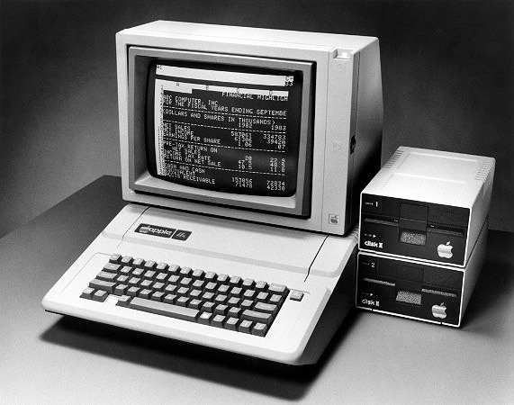

Slingcode is a **personal computing platform** in a [single html file](https://slingcode.net/slingcode.html).

* You can **make, run, and share web apps** with it.
* You don't need any complicated tools to use it, **just a web browser**.
* You don't need a server, hosting, or an SSL certificate to run the web apps.
* You can put Slingcode on a web site, run it from a USB stick, laptop, or phone, and it doesn't need an internet connection to work.
* You can "**add to home screen**" in your phone's browser to easily access your library of programs on the go.
* You can **share apps peer-to-peer** over WebTorrent.
* **It's private**. You only share what you choose.

## Try it: [slingcode.html](https://slingcode.net/slingcode.html)

Or right-click on [`slingcode.html`](https://slingcode.net/slingcode.html) and "save link as" to download the HTML file onto your own computer.

### Video

### About

There is no server component for Slingcode. The apps are stored in the web browser's local storage, completely offline. You can move apps between browsers by using the peer-to-peer send and receive feature. You can also export an app as a zip file and import it into another Slingcode instance, or upload your app onto regular web hosting to deploy it online.

> Your computer. Your software. Your data.

### Nostalgia

Remember when computers were fun? When a kid could type out a BASIC listing from a magazine and make magic with light and sound. When your computer belonged to you and you could understand the software running on it.

I'm trying to recreate that magic with Slingcode. To get rid of all the tooling and dependencies and hosting problems, and make coding fun again. To help you bridge the gap between your idea and running code.

I built it so I can teach my kids to code without all the complex setup you need these days. I'm trying to re-create the simple environment I had when I learned to code with my Mum on an Apple IIe back in the 80s.

### Who

Hi, 👋 I'm Chris and I made this.

You can find me online here:

* [@mccrmx](https://twitter.com/mccrmx)
* [mccormick.cx](https://mccormick.cx/)

### Hack & contribute

Slingcode is built with [ClojureScript](https://clojurescript.org/). To get started contributing to Slingcode itself, [check out the codebase](https://github.com/chr15m/slingcode) and run `make`. You'll need Node and Java installed.

### Inspiration

> ...situated software. This is software designed in and for a particular social situation or context. ...a "small pieces, loosely joined" way of making software... Situated software isn't a technological strategy so much as an attitude about closeness of fit between software and its group of users, and a refusal to embrace scale, generality or completeness as unqualified virtues.

-- Clay Shirky, [Situated Software](https://web.archive.org/web/20040411202042/http://www.shirky.com/writings/situated_software.html)

> ...in the original visions of many personal computing pioneers... the PC was intended as personal property – the owner would have total control (and understanding) of the software running on the PC, including the ability to copy bits on the PC at will. Software complexity, Internet connectivity, and unresolved incentive mismatches between software publishers and users (PC owners) have substantially eroded the reality of the personal computer as personal property.

-- Nick Szabo, [Trusted Third Parties are Security Holes](https://nakamotoinstitute.org/trusted-third-parties/)

> The trick is to fix the problem you have, rather than the problem you want.

-- Bram Cohen

> Kakehashi had no musical training, and wanted musical instruments to be accessible for professionals as well as amateurs like himself. He also wanted them to be inexpensive, intuitive, small, and simple.

-- [Wikipedia, Ikutaro Kakehashi](https://en.wikipedia.org/wiki/Ikutaro_Kakehashi)

### Copyright

Slingcode is Copyright Chris McCormick, 2020.

Distributed under the MIT software license. See [license.txt](./license.txt) for details.
